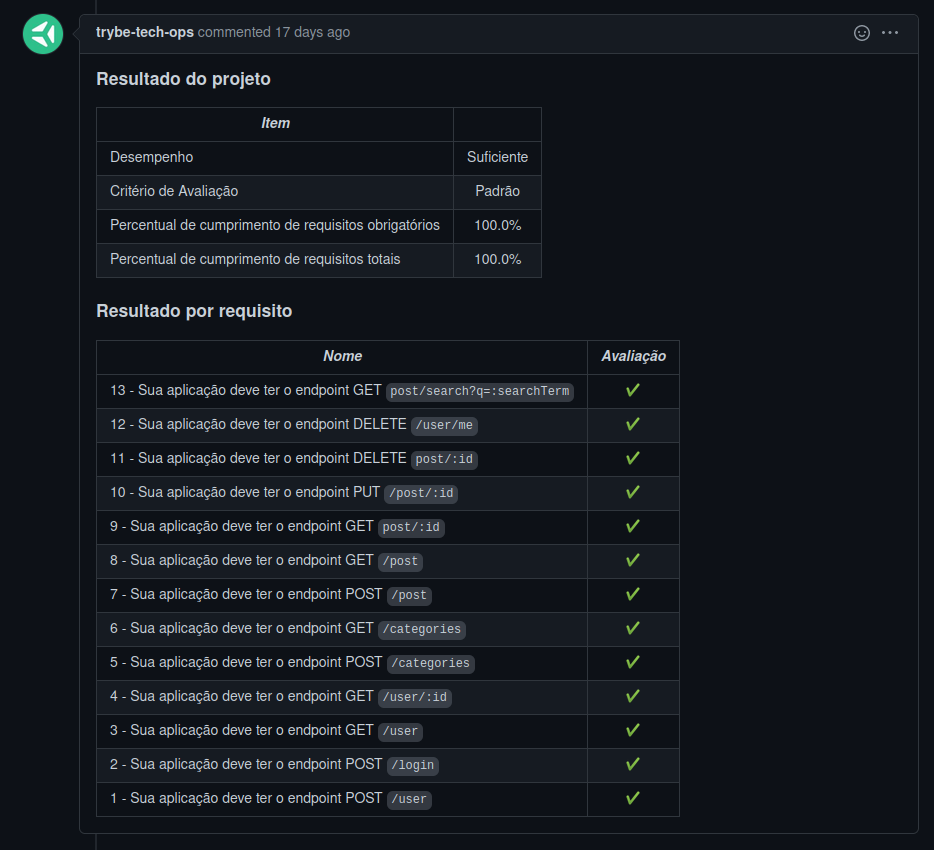

# Welcome to the Project Blogs API

## Context

This project was made as a work assignment in during the Trybe web developer course.

The goal was to utilize all our learnings in MySQL and sequelize, and create a RESTful API using the ORM and SOLID principles.

---

## How to install

For this project, you will need to have installed:
- NPM
- MySQL

Copy the ssh from the project `git@github.com:luciobj/Project-Blogs-API.git`

* Open a terminal int your machine and type the following commands in order:

  * `git clone git@github.com:luciobj/Project-Blogs-API.git`
  * `cd Project-Blogs-API`
  * `npm install`

---

### Technologies

In this project the tecnologies used were NPM, MySQL and Sequelize.

---

## Evaluator Results

This is a screenshot of the last run of the Trybe evaluator, which scores the demands of the project.

